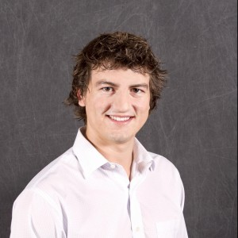

# pwndevils History

The pwndevils team was started in 2009 by [Mike Mabey](https://mikemabey.com/) and [Dr. Gail-Joon Ahn](http://www.public.asu.edu/~gahn1/), however it ended up dormant until revived in 2015 by Mike Mabey and [Dr. Adam Doupé](https://adamdoupe.com/). 
Dr. Doupé has continued to act as the Advisor of the club. [Dr. Yan Shoshitaishvili](http://www.yancomm.net/) has been added as an advisor of the club since Fall of 2017. In 2018 [Dr. Fish Wang](https://ruoyuwang.me/) was added to the advisors to complete the epic hacking trifecta. 
Playing ctfs, pwndevils did well from 2017-2020 culminating in the official change to playing as [Shellphish](http://shellphish.net/), continuing the legacy of the oldest hacking team in the United States. 
We now act as a hacking club at ASU and play all CTFs as Shellphish. You can find our club constitution [here](./const.html). You can find our ctf manifesto [here](http://shellphish.net/). 

# Faculty Advisors

The pwndevils would not exist without the support of the following faculty members (who try to hack right alongside the team)

|  Adam Doupé |  Yan Shoshitaishvili | Fish Wang |
|:-------------|:------------------|:--------------------|
|  |  | |

<!--
|  |  | |
-->

<!-- #### Adam Doupé

 
#### Yan Shoshitaishvili

-->
# Leadership
pwndevil officers make things go: they organize meetings, get food for meetings (yay), and are generally awesome people. 

* **Root:** Zion Basque
* **V33P:** Nathan Smith
* **Banker:** Erin Ozcan 

